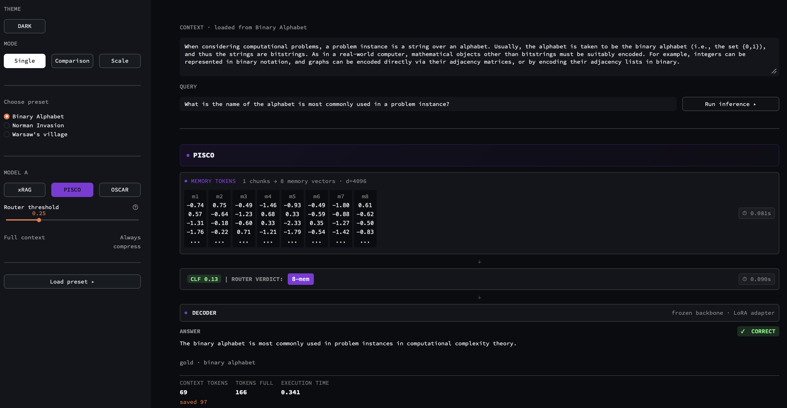
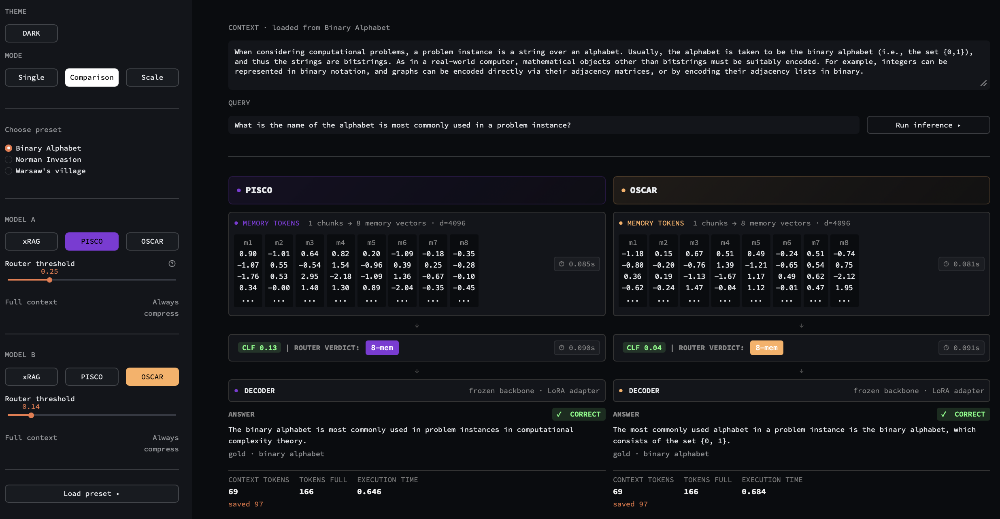
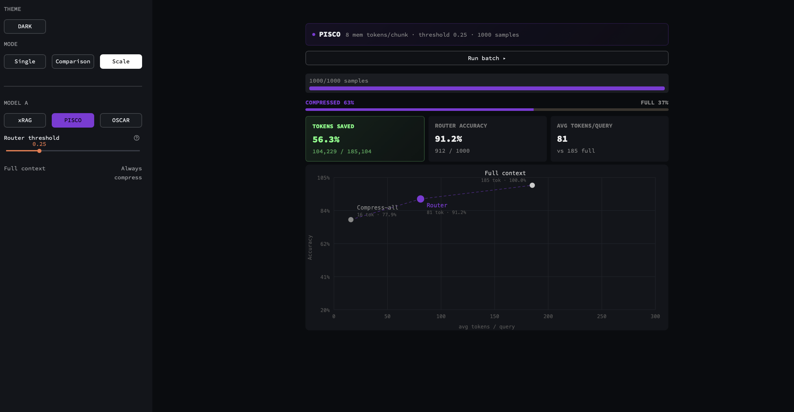

# compression_router

A framework for training lightweight routing classifiers on top of context-compression models. Given a compression model (PISCO, OSCAR, xRAG, or your own), `compression_router` learns when compressed context is good enough and when to fall back to the full context — saving tokens without sacrificing accuracy.

## How it works

1. **Collect**: run both compressed and full paths on a training set, extract classifier features
2. **Evaluate**: score predictions with EM/F1 or an LLM judge
3. **Train**: learn a routing threshold via stratified k-fold CV (Youden's J), then train a final MLP classifier on all data
4. **Infer**: at runtime, compress → classify → route to compressed or full generation

## Demo

Interactive Streamlit app for exploring routing decisions across all three models. Three modes:

- **Single** — run one model, inspect memory tokens, CLF score, router verdict, and token savings
- **Comparison** — run two models side-by-side on the same query
- **Scale** — batch evaluation over 1000 samples with accuracy/token-savings tradeoff plot

<p>
  
  
  
</p>

```bash
cd demo
pip install -r requirements.txt
streamlit run app.py
```

See [`demo/README.md`](demo/README.md) for setup details.

## Installation

```bash
pip install -e .
```

Requires: `torch`, `transformers`, `scikit-learn`, `rich`, `huggingface_hub`

Optional: `openai` (for LLM judge evaluation)

## Quick start

### 1. Subclass `CompressRouterModule`

You implement **4 methods** that define how your compression model works. The framework handles everything else (data loading, evaluation, CV, CLF training, saving).

```python
from compression_router import CompressRouterModule

class MyRouter(CompressRouterModule):

    def compress(self, documents: list[str], query: str | None = None) -> torch.Tensor:
        """Compress document chunks into memory embeddings."""
        return self.model.compress(documents)

    def generate_compressed(self, compressed_embs: torch.Tensor, query: str, **kw) -> str:
        """Generate an answer using compressed context."""
        return self.model.generate(compressed_embs, query)

    def generate_full(self, context: str, query: str, **kw) -> str:
        """Generate an answer using the full uncompressed context."""
        return self.model.generate_full(context, query)

    def extract_clf_features(self, compressed_embs: torch.Tensor, query: str) -> torch.Tensor:
        """Return a 1-D feature vector for the routing classifier.

        Typically: register a forward hook on a decoder mid-layer,
        run a forward pass with the compressed embeddings, and return
        the last-token hidden state.
        """
        ...
```

These are the only methods you **must** implement. See `examples/` for full implementations on real models.

### 2. Optional overrides

You can customize any part of the pipeline by overriding additional methods:

| Method | Default | Override when... |
|---|---|---|
| `_load_model(path, **kw)` | `AutoModel.from_pretrained` | Your model needs custom loading (e.g. multiple sub-models, adapters) |
| `_chunk_text(text)` | Tokenizer-based chunking | Your model has a specific chunking strategy |
| `park_gpu()` / `unpark_gpu()` | Move entire model to/from GPU | You need partial GPU placement (e.g. xRAG swaps retriever and LLM) |
| `count_tokens_full(ctx, query)` | `len(tokenizer.encode(ctx))` | Token counting should include the prompt template |
| `count_tokens_compressed(embs, query)` | Embedding shape-based | Compressed token count depends on your architecture |
| `on_stage_enter(stage)` / `on_stage_exit(stage)` | No-op | You need stage-aware caching or GPU management |

### 3. Train

```python
from compression_router import TrainConfig, train_router

router = MyRouter.from_pretrained("my-model")
router.park_gpu()

cfg = TrainConfig(
    dataset="train.jsonl",           # JSONL with {"context", "query", "gold"}
    eval_dataset="test.jsonl",
    output_dir="./my_router_ckpt",
    epochs=100,
    n_folds=5,
)

result = train_router(router, cfg)
```

### 4. Inference

```python
router = MyRouter.from_pretrained("./my_router_ckpt")  # loads base model + CLF
router.park_gpu()

result = router.run_pipeline("long document text...", query="what is X?")
# {"prediction": "...", "mode": "compressed", "clf_prob": 0.32,
#  "tokens_full": 1024, "tokens_compressed": 48, "tokens_saved": 976}
```

## Dataset format

JSONL with one object per line:

```json
{"context": "The capital of France is Paris...", "query": "What is the capital of France?", "gold": "Paris"}
```

Column names are configurable via `TrainConfig(column_map={...})`.

## Customizing evaluation

Two built-in evaluators:

- **`default_evaluate`** — EM or token-F1 >= 0.5 (fast, no API calls)
- **`llm_judge()`** — async LLM judge via DeepSeek (or any OpenAI-compatible API)

```python
from compression_router import llm_judge

result = train_router(router, cfg, evaluator=llm_judge(concurrency=30, model="deepseek-chat"))
```

You can also pass any custom evaluator — it's just a callable that scores results in-place:

```python
def my_evaluator(results: list[dict]) -> None:
    """Set 'full_correct' and 'comp_correct' (bool) on each result dict."""
    for r in results:
        r["full_correct"] = my_metric(r["full_answer"], r["gold"])
        r["comp_correct"] = my_metric(r["comp_answer"], r["gold"])

result = train_router(router, cfg, evaluator=my_evaluator)
```

Set `DEEPSEEK_API_KEY` env var for `llm_judge`, or pass `api_key=` directly. Any OpenAI-compatible endpoint works via `base_url=`.

## Customizing the classifier

The default classifier is a 2-layer MLP (`d_input → 512 → 128 → 1`). You can adjust it via `TrainConfig`:

```python
cfg = TrainConfig(
    clf_hidden=512,       # hidden layer size
    clf_dropout=0.3,      # dropout rate
    epochs=100,           # max training epochs
    lr=1e-4,              # learning rate
    patience=12,          # early stopping patience
    warmup_epochs=5,      # cosine LR warmup
)
```

Or substitute your own `nn.Module` entirely — the only contract is `forward(x) → (batch,)` logits and `predict(x) → (batch,)` probabilities.

## Customizing feature collection

The `collect_features` loop runs both paths on every sample, then calls `extract_clf_features` to get the classifier input. The feature vector is entirely up to you — it doesn't have to be a hidden state. You could return:

- A mid-layer hidden state (default in examples)
- Concatenation of multiple layer states
- Compression ratio + perplexity + attention entropy
- Any fixed-size tensor

The classifier trains on whatever your `extract_clf_features` returns.

## Training configuration

Key `TrainConfig` fields:

| Field | Default | Description |
|---|---|---|
| `dataset` | required | Path to training JSONL |
| `eval_dataset` | `None` | Path to held-out eval JSONL |
| `epochs` | `60` | Max classifier training epochs |
| `n_folds` | `5` | Stratified CV folds for threshold search |
| `skip_full_wrong` | `True` | Drop samples where full answer is wrong |
| `patience` | `12` | Early stopping patience |
| `threshold_policy` | `"youden"` | Threshold selection: Youden's J statistic, or pass a callable |
| `push_to_hub` | `False` | Push to HuggingFace after training |
| `hub_repo_id` | `None` | HF repo ID for push |

## Examples

Full training scripts for three compression models:

- [`examples/train_pisco.py`](examples/train_pisco.py) — PISCO (COCOM architecture)
- [`examples/train_oscar.py`](examples/train_oscar.py) — OSCAR (COCOM with query-aware compression)
- [`examples/train_xrag.py`](examples/train_xrag.py) — xRAG (dual-model: SFR retriever + Mistral LLM, with phased GPU management)

Each example shows a complete `CompressRouterModule` subclass with all 4 required methods, custom model loading, and training invocation.

## Trained routers

| Model | HF Repo | Base model |
|---|---|---|
| PISCO | [`wexumin/pisco-7b-router`](https://huggingface.co/wexumin/pisco-7b-router) | `naver/pisco-mistral` |
| OSCAR | [`wexumin/oscar-7b-router`](https://huggingface.co/wexumin/oscar-7b-router) | `naver/oscar-mistral-7B` |
| xRAG | [`wexumin/xrag-7b-router`](https://huggingface.co/wexumin/xrag-7b-router) | `Hannibal046/xrag-7b` |

## Project structure

```
compression_router/          # pip-installable package
    base.py               # CompressRouterModule base class
    classifier.py         # RouterClassifier MLP
    config.py             # TrainConfig dataclass
    evaluate.py           # EM/F1 + LLM judge evaluators
    train.py              # training pipeline (collect → CV → train → save)
examples/
    train_pisco.py        # PISCO training script
    train_oscar.py        # OSCAR training script
    train_xrag.py         # xRAG training script
demo/
    app.py                # Streamlit interactive demo
    mock_model.py         # mock model for UI testing without GPU
    presets.json          # preset context/query pairs
    scale_data.json       # pre-computed batch results
pics/                     # screenshots for README
```

## Stage lifecycle

During training, the model progresses through stages accessible via `model.stage`:

```
idle → train_collect → train_evaluate → train_threshold_search → train_clf
     → eval_collect → eval_evaluate → eval_clf → save → idle
```

Subclasses can override `on_stage_enter(stage)` / `on_stage_exit(stage)` for custom GPU management or caching. See the xRAG example for a dual-model swap pattern where SFR embeddings are precomputed per stage, then the LLM stays on GPU for the rest of training.

## License

Apache 2.0
