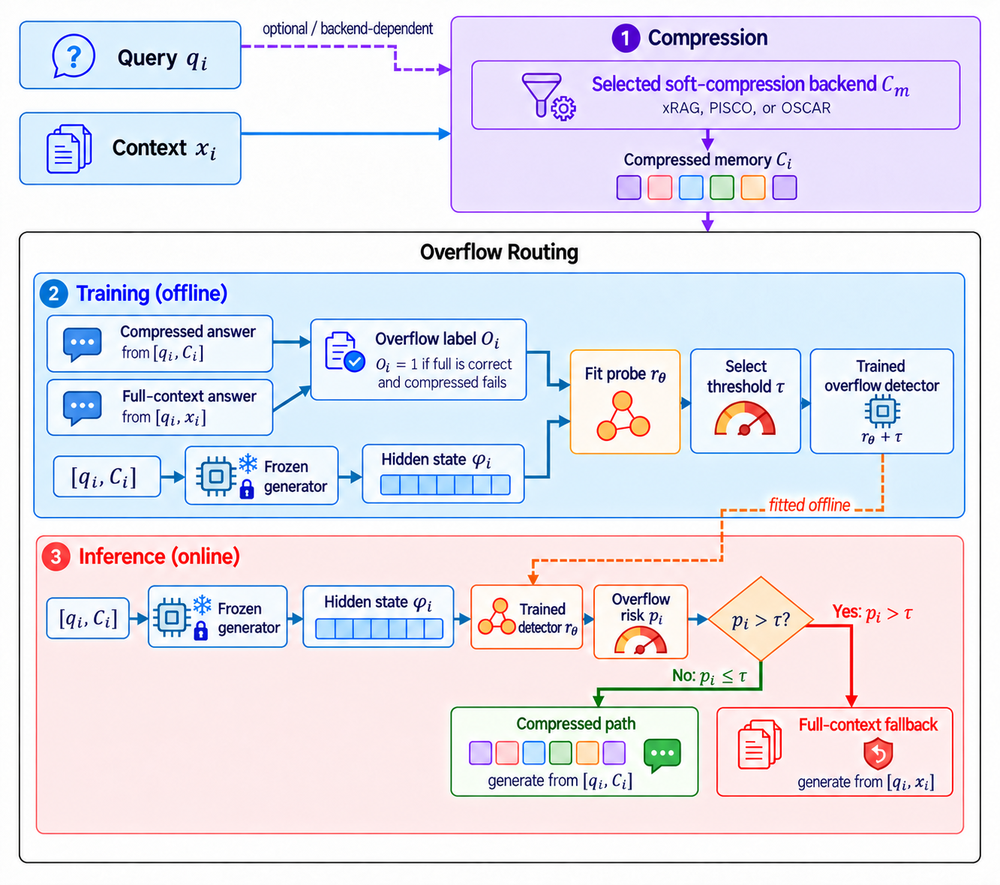
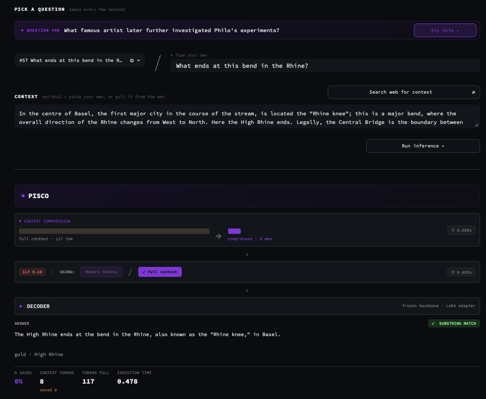
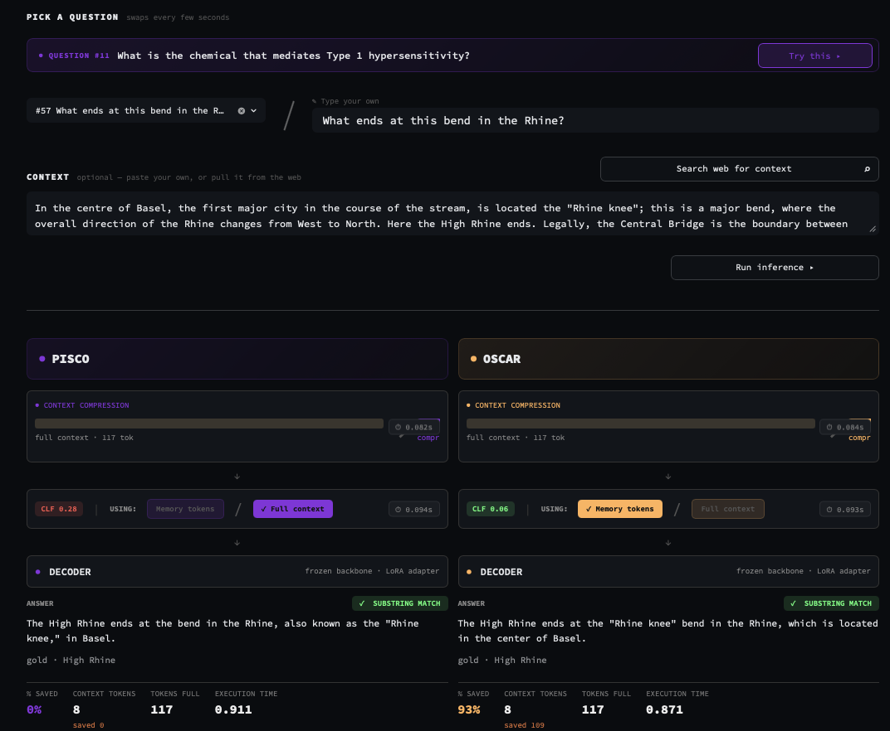
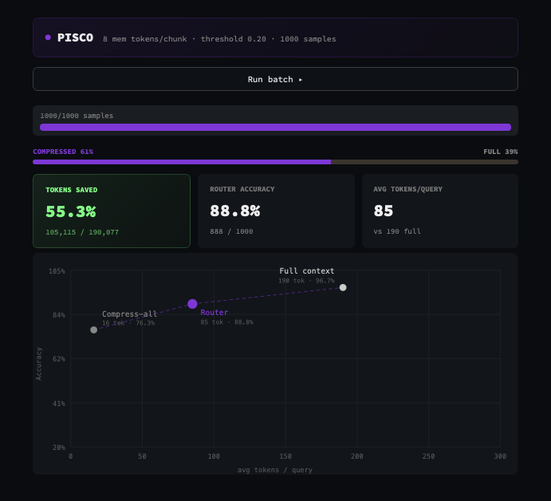

# OverflowGuard

A framework for training lightweight routing classifiers on top of context-compression models. Given a compression model (PISCO, OSCAR, xRAG, or your own), `overflowguard` learns when compressed context is good enough and when to fall back to the full context — saving tokens without sacrificing accuracy.

## How it works

1. **Collect**: run both compressed and full paths on a training set, extract classifier features
2. **Evaluate**: score predictions with EM/F1 or an LLM judge
3. **Train**: stratified k-fold CV, pick the routing threshold from the out-of-fold probabilities (Youden's J), and keep the fold models as an ensemble
4. **Infer**: at runtime, compress → classify → route to compressed or full generation

A sample is labelled **overflow** when the compressed answer is wrong *and* the full answer is right — the only case routing to full context can fix. High classifier probability means likely overflow, so the router sends it to full context; everything at or below the threshold goes compressed.

<p>
  
</p>

## Demo

Interactive Streamlit app for exploring routing decisions across all three models. Three modes:

- **Single** — run one model, inspect memory tokens, CLF score, router verdict, and token savings
- **Compare** — run two models side-by-side on the same query
- **Batch** — batch evaluation over 1000 samples with accuracy/token-savings tradeoff plot

<p>
  
  
  
</p>

```bash
pip install -r requirements.txt
cd demo
streamlit run app.py
```

It runs on a mock model by default, so no GPU is needed. See [`demo/README.md`](demo/README.md) for setup details.

## Installation

```bash
git clone https://github.com/s-nlp/overflowguard
cd overflowguard
pip install -r requirements.txt
```

Run training scripts from the repo root (or add it to `PYTHONPATH`) so `import overflowguard` resolves.

Requires: `torch`, `transformers`, `scikit-learn`, `rich`, `huggingface_hub`, `pyyaml`

Optional: `openai` (LLM judge), plus `streamlit`, `ddgs`, `beautifulsoup4`, `requests` (demo)

## Quick start

### 1. Subclass `OverflowRouter`

You implement **4 methods** that define how your compression model works. The framework handles everything else (data loading, evaluation, CV, CLF training, saving).

```python
from overflowguard import OverflowRouter

class MyRouter(OverflowRouter):

    def compress(self, documents: list[str], query: str | None = None) -> torch.Tensor:
        """Compress document chunks into memory embeddings."""
        return self.model.compress(documents)

    def generate_compressed(self, compressed_embs: torch.Tensor, query: str, **kw) -> str:
        """Generate an answer using compressed context."""
        return self.model.generate(compressed_embs, query)

    def generate_full(self, context: str, query: str, **kw) -> str:
        """Generate an answer using the full uncompressed context."""
        return self.model.generate_full(context, query)

    def extract_clf_features(self, compressed_embs: torch.Tensor, query: str) -> torch.Tensor:
        """Return a 1-D feature vector for the routing classifier.

        Typically: register a forward hook on a decoder mid-layer,
        run a forward pass with the compressed embeddings, and return
        the last-token hidden state.
        """
        ...
```

These are the only methods you **must** implement — the base class is abstract, so a subclass that misses one fails at construction. See `examples/` for full implementations on real models.

### 2. Optional overrides

You can customize any part of the pipeline by overriding additional methods:

| Method | Default | Override when... |
|---|---|---|
| `_load_model(path, **kw)` | `AutoModel.from_pretrained` | Your model needs custom loading (e.g. multiple sub-models, adapters) |
| `_chunk_text(text)` | Tokenizer-based chunking | Your model has a specific chunking strategy |
| `park_gpu()` / `unpark_gpu()` | Move entire model to/from GPU | You need partial GPU placement (e.g. xRAG swaps retriever and LLM) |
| `count_tokens_full(ctx, query)` | `len(tokenizer.encode(ctx))` | Token counting should include the prompt template |
| `count_tokens_compressed(embs, query)` | `embs.numel() // embs.shape[-1]` | Compressed token count depends on your architecture |
| `on_stage_enter(stage)` / `on_stage_exit(stage)` | No-op | You need stage-aware caching or GPU management |
| `*_batch` variants | Per-sample loop | Collection should run in batches — see [Batched collection](#batched-collection) |

### 3. Train

```python
from overflowguard import TrainConfig, train_router

router = MyRouter.from_pretrained("my-model")
router.park_gpu()

cfg = TrainConfig(
    dataset="train.jsonl",           # JSONL with {"context", "query", "gold"}
    eval_dataset="test.jsonl",
    output_dir="./my_router_ckpt",
    epochs=60,
    n_folds=5,
)

result = train_router(router, cfg)
```

Or from the command line, with the config in YAML:

```bash
python -m overflowguard \
    --config router_config.yaml \
    --model my_module:MyRouter \
    --model_path /models/my-model
```

Add `--force` to ignore a cached collection and recompute features.

Training writes `router_config.json`, `routing_clf.pt` and `train_summary.json` to `output_dir`.

### 4. Inference

```python
router = MyRouter.from_pretrained("./my_router_ckpt")  # loads base model + CLF
router.park_gpu()

result = router.run_pipeline("long document text...", query="what is X?")
# {"prediction": "...", "mode": "compressed", "clf_prob": 0.32,
#  "tokens_full": 1024, "tokens_compressed": 48, "tokens_saved": 976,
#  "exec_time": 0.41}
```

`from_pretrained` accepts a local directory or a Hub repo id, and loads the base model named in `router_config.json` along with the classifier. Pointing it at a bare model (no `router_config.json`) loads just the model, which is how you start training.

Pass `mode="compressed"` or `mode="full"` to bypass the router; `mode="auto"` (the default) needs a classifier and raises a clear error without one. `run_pipeline_with_progress` yields the same run stage by stage (`compression`, `router`, `generation`, `done`) for live UIs.

## Dataset format

JSONL with one object per line:

```json
{"context": "The capital of France is Paris...", "query": "What is the capital of France?", "gold": "Paris"}
```

`gold` may also be a list of accepted answers. Column names are configurable via `TrainConfig(column_map={...})`.

## Resuming and caching

Feature collection is the expensive part, so it's checkpointed to `<output_dir>/collection.pt` roughly every 256 samples and on interruption. Re-running the same config resumes from the last saved sample instead of regenerating. The cache keeps **every** row along with its answers and verdicts; `skip_full_wrong` filters rows in memory for one run, never on disk.

If verdicts are missing (an interrupted LLM judge, say), the next run scores only the rows that still need it. A judge call that fails after all retries leaves its verdict unset, so training refuses to run on partial labels and the next run retries those rows.

## Batched collection

Set `collect_batch_size` above 1 to fan out collection. For each of the four steps the framework uses the batched method when your router defines one and falls back to the per-sample method otherwise:

| Per-sample | Batched |
|---|---|
| `generate_full` | `generate_full_batch(contexts, queries, max_new_tokens=…)` |
| `compress` | `compress_batch(docs, queries=…)` |
| `generate_compressed` | `generate_compressed_batch(embs, queries, max_new_tokens=…)` |
| `extract_clf_features` | `extract_clf_features_batch(contexts, queries, compressed_embs=…)` |

Routers that implement only the 4 required methods keep working unchanged.

## Layer sweep

With `TrainConfig(sweep=True)`, `extract_clf_features` must return a stacked `(n_layers, …)` feature per sample. Training then repeats the whole pipeline per layer and writes a ranked `sweep_results.json` instead of fitting one router — useful for picking which decoder layer to hook. See [`examples/sweep_pisco.py`](examples/sweep_pisco.py).

## Customizing evaluation

Two built-in evaluators:

- **`default_evaluate`** — EM or token-F1 >= 0.5 (fast, no API calls)
- **`llm_judge()`** — async LLM judge via DeepSeek (or any OpenAI-compatible API)

```python
from overflowguard import llm_judge

result = train_router(router, cfg, evaluator=llm_judge(concurrency=30, model="deepseek-chat"))
```

You can also pass any custom evaluator — it's just a callable that scores results in-place:

```python
def my_evaluator(results: list[dict]) -> None:
    """Set 'full_correct' and 'comp_correct' (bool) on each result dict."""
    for r in results:
        r["full_correct"] = my_metric(r["full_answer"], r["gold"])
        r["comp_correct"] = my_metric(r["comp_answer"], r["gold"])

result = train_router(router, cfg, evaluator=my_evaluator)
```

Set `DEEPSEEK_API_KEY` env var for `llm_judge`, or pass `api_key=` directly. Any OpenAI-compatible endpoint works via `base_url=`. Each verdict is judged independently, so an evaluator only ever fills in what's missing and never overwrites verdicts already on disk.

## Customizing the classifier

The default classifier is a 2-layer MLP (`d_input → 512 → 128 → 1`). You can adjust it via `TrainConfig`:

```python
cfg = TrainConfig(
    clf_hidden=512,       # hidden layer size
    clf_dropout=0.3,      # dropout rate
    epochs=60,            # max training epochs
    lr=1e-4,              # learning rate
    patience=12,          # early stopping patience
    warmup_epochs=5,      # cosine LR warmup
)
```

What ships in the checkpoint is a `RouterEnsemble`: the K cross-validation fold models averaged, with feature standardization baked in, so inference passes raw features straight through.

## Customizing feature collection

The `collect_features` loop runs both paths on every sample, then calls `extract_clf_features` to get the classifier input. The feature vector is entirely up to you — it doesn't have to be a hidden state. You could return:

- A mid-layer hidden state (default in examples)
- Concatenation of multiple layer states
- Compression ratio + perplexity + attention entropy
- Any fixed-size tensor

The classifier trains on whatever your `extract_clf_features` returns.

## Training configuration

Key `TrainConfig` fields:

| Field | Default | Description |
|---|---|---|
| `dataset` | required | Path to training JSONL |
| `eval_dataset` | `None` | Path to held-out eval JSONL |
| `max_samples` | `None` | Cap on rows read from the dataset |
| `epochs` | `60` | Max classifier training epochs |
| `n_folds` | `5` | Stratified CV folds for threshold search |
| `patience` | `12` | Early stopping patience |
| `skip_full_wrong` | `False` | Exclude rows whose full answer is wrong from **training** (in memory, train split only) |
| `collect_batch_size` | `1` | Samples per collection batch (see [Batched collection](#batched-collection)) |
| `sweep` | `False` | Per-layer sweep instead of fitting one router |
| `threshold_policy` | `"youden"` | Threshold selection: Youden's J statistic, or pass a callable |
| `max_new_tokens` | `64` | Generation length cap during collection |
| `seed` | `42` | Seed for CV splits and per-fold init |
| `output_dir` | `"./router_checkpoint"` | Where the collection and checkpoint are written |
| `push_to_hub` | `False` | Push to HuggingFace after training |
| `hub_repo_id` | `None` | HF repo ID for push (required when `push_to_hub=True`) |

`TrainConfig.from_yaml("router_config.yaml")` reads the same fields, either flat or grouped under `data`, `clf`, `training` and `output`.

## Publishing a router

```python
router.save_pretrained("./my_router_ckpt")   # router_config.json + routing_clf.pt
router.push_to_hub("user/my-pisco-router")   # one commit, base model referenced not copied

# or into a subfolder, the layout used by the checkpoints repo
router.push_to_hub("user/my-checkpoints", hf_local_path="pisco/mistral-7b/squad")
```

The base model is never copied — `router_config.json` just records its path, so a router repo stays a few MB. Only those two files are uploaded, even when you push straight from a training run folder that also holds `collection.pt`. Both files go up in a single commit, so a failed upload can't leave a new threshold beside old weights.

## Examples

Full training scripts for three compression models:

- [`examples/train_pisco.py`](examples/train_pisco.py) — PISCO (COCOM architecture)
- [`examples/train_oscar.py`](examples/train_oscar.py) — OSCAR (COCOM with query-aware compression)
- [`examples/train_xrag.py`](examples/train_xrag.py) — xRAG (dual-model: SFR retriever + Mistral LLM, with phased GPU management)

Each example shows a complete `OverflowRouter` subclass with all 4 required methods, custom model loading, and training invocation.

The same folder holds the analysis and paper-figure utilities used on top of finished runs — layer sweeps (`sweep_pisco.py`, `plot_sweep.py`), re-scoring and re-training from a saved collection (`train_from_collection.py`, `reset_labels.py`), results tables (`results_table.py`, `latex_results_table.py`), efficiency benchmarks (`benchmark_efficiency.py`) and plots (`plot_acc_savings.py`, `transfer_heatmap.py`).

## Trained routers

All released routers live in one Hub repo — [`wexumin/OverflowGuard-checkpoints`](https://huggingface.co/wexumin/OverflowGuard-checkpoints) — laid out as `{compressor}/{model}/{dataset}/`, each folder holding the usual `router_config.json` and `routing_clf.pt`.

| Compressor | Models | Datasets |
|---|---|---|
| `pisco` | `mistral-7b`, `solar-7b`, `llama-8b` | `squad`, `hotpotqa`, `triviaqa`, `combined` |
| `oscar` | `mistral-7b`, `mistral-24b`, `qwen-7b` | `squad`, `hotpotqa`, `triviaqa`, `combined` |
| `xrag` | `mistral-7b`, `mixtral-8x7b` | `squad`, `hotpotqa`, `triviaqa`, `combined` |

Pick one with `hf_local_path`, which downloads only that folder's two files:

```python
from train_pisco import PiscoRouter   # examples/train_pisco.py

router = PiscoRouter.from_pretrained(
    "wexumin/OverflowGuard-checkpoints",
    hf_local_path="pisco/mistral-7b/squad",
)
```

Use the router class that matches the compressor (`PiscoRouter`, `OscarRouter`, `XragRouter`). The base language model named in `router_config.json` — `naver/pisco-mistral`, `naver/oscar-mistral-7B`, `Hannibal046/xrag-7b` and so on — is downloaded separately by `from_pretrained`.

The repo's model card carries the full results tables (AUC, accuracy before and after routing, share of queries kept compressed, token savings) for every checkpoint.

## Project structure

```
overflowguard/            # the package
    base.py               # OverflowRouter base class
    classifier.py         # RouterClassifier MLP + RouterEnsemble
    config.py             # TrainConfig dataclass
    evaluate.py           # EM/F1 + LLM judge evaluators
    train.py              # training pipeline (collect → CV → threshold → save)
examples/
    train_pisco.py        # PISCO training script
    train_oscar.py        # OSCAR training script
    train_xrag.py         # xRAG training script
    ...                   # sweeps, tables, plots and other analysis utilities
demo/
    app.py                # Streamlit interactive demo
    routers.py            # OverflowRouter subclasses used by the demo
    mock_model.py         # mock model for UI testing without GPU
    new_presets.jsonl     # preset questions with saved per-model answers
    scale_data.json       # pre-computed batch results
pics/                     # screenshots for README
```

## Stage lifecycle

During training, the model progresses through stages accessible via `model.stage`:

```
idle → train_collect → train_evaluate → train_threshold_search → train_clf
     → eval_collect → eval_evaluate → eval_clf → save → idle
```

Subclasses can override `on_stage_enter(stage)` / `on_stage_exit(stage)` for custom GPU management or caching. See the xRAG example for a dual-model swap pattern where SFR embeddings are precomputed per stage, then the LLM stays on GPU for the rest of training.

## License

Apache 2.0
